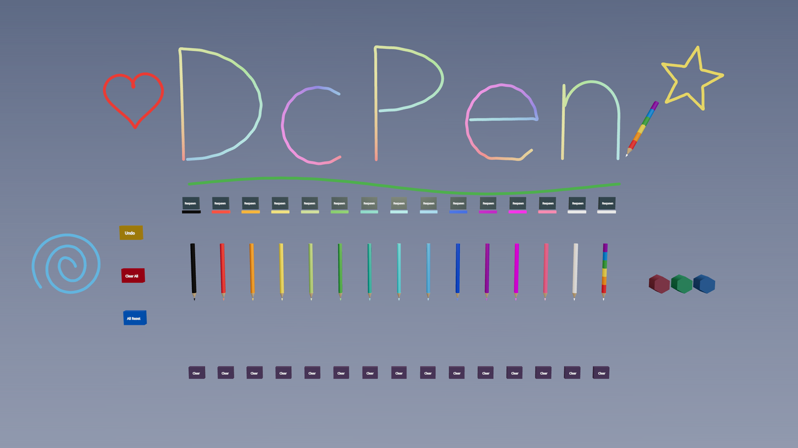

# DcPen ✏️

**[XRift](https://xrift.net/) 用の空間らくがきペン** — VRChat の [QvPen](https://booth.pm/ja/items/1555789) の操作体系を、XRift のワールドとアイテムの両方に持ち込んだものです。

*A QvPen-style spatial drawing pen for XRift worlds & items.*



## できること

- 鉛筆型の **14色＋虹ペン** が空中のラックに並ぶ（虹ペンの線は虹色グラデーション）
- **VR**: 左右どちらの手でもグリップ（握る）で掴む。**両手に1本ずつ持てる**。掴んだ瞬間の持ち方のまま手に追従（縦持ち・横持ち自由）。グリップを離すと**その場の空中に浮いて留まる**
- 持ち手のトリガーで描く。**トリガー2連打（0.2秒）で消しゴムモード**＝ペン先が球になり、触れた部分だけ削れる**部分消し**（線は残りに分割。本家に無い拡張）
- **消しゴム×3**: 掴んでトリガーで線に当てると、その線が1本消える（本家準拠）
- ペンごとの **Respawn / Clear（色別消し）** ボタン、左パネルに **Undo / Clear All / All Reset**
- 線・持ち主・浮遊位置はインスタンス内で**全員に同期**。late joiner にも復元
- **デスクトップ**: クリックで持つ／戻す・左ボタン長押しで描く
- 描いた線はインスタンスが生きている限り残る＝**書き置き**ができる

## ワールドに置く

```bash
npm install xrift-dcpen
```

```tsx
import { DcPen } from 'xrift-dcpen'

export const World = () => (
  <>
    {/* 任意の位置・向きに置ける。複数置くなら syncId を変える */}
    <DcPen position={[0, 0, -3]} rotationY={Math.PI / 4} />
  </>
)
```

| prop | 既定 | 説明 |
| --- | --- | --- |
| `position` | `[0, 0, 0]` | 設置位置（ラックの足元） |
| `rotationY` | `0` | Y回転。ラック正面は +Z |
| `syncId` | `'dcpen'` | 同期キーの名前空間。複数設置時は一意にする |

依存（`react` / `three` / `@react-three/fiber` / `@react-three/drei` / `@react-three/rapier` / `@xrift/world-components`）はすべて peerDependencies です。XRift ワールドプロジェクトなら追加インストールは不要です。

## アイテム版

このリポジトリは XRift アイテムとしてもビルドされます（`npm run build` → `xrift upload item`）。アイテム版はインベントリからどのワールドにも設置できます。

## 名前の由来

特にありません。

## クレジット

- 操作体系は [QvPen](https://github.com/ureishi/QvPen)（ureishi さん）へのリスペクト実装です。コードは React Three Fiber でゼロから書いており、本家（UdonSharp）からの流用はありません
- 参考: [HQ・LQ切り替えスイッチ付ミラー](https://booth.pm/ja/items/3640350) ほか VRChat のワールドギミック文化

## 開発

```bash
npm install
npm run dev        # devプレビュー (https, ?preview で設置プレビュー確認)
npm run build      # XRiftアイテムのビルド (Module Federation)
npm run build:lib  # npmライブラリのビルド (lib/)
```

## License

[MIT](LICENSE)
